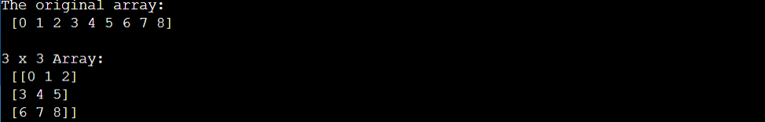
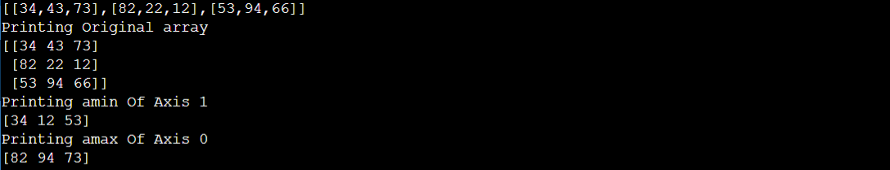
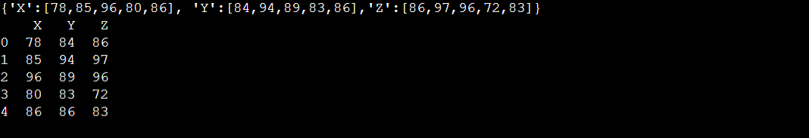
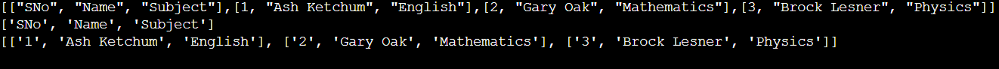
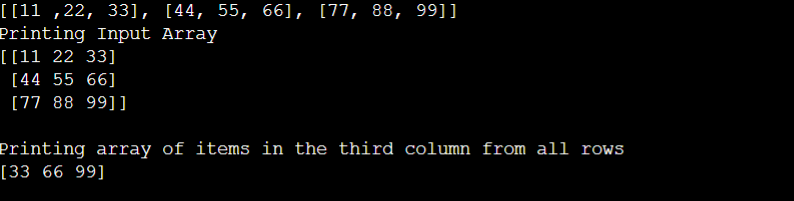

# EX NO 5B(a)
## 🎯 Aim
To write a Numpy program to Convert a 1-D array into a 2-D array with 3 rows

## 🧠 Algorithm
1. Get a list as input from the user.
2. Convert it into a numpy array using np.array()
3. Convert it into 3 by 3 array using np.reshape()

## 💻 Program
```
import numpy as np
import array
list1=eval(input())
a=np.array(list1)
print("The original array:")
print('',np.array(list1),'\n')
print("3 x 3 Array:")
print('',np.array(list1).reshape(3,3))
```

## Output


## Result
Thus a python program to write a numpy program to convert a 1-D array into a 2-D array with 3 rows has been written and executed successfully.

# EX NO 5B(b)
## 🎯 Aim
To write a python program to print max from axis 0 and min from axis 1 from the given 2-D array.

## 🧠 Algorithm
1. Get list as input from the user
2. Convert it into a numpy array using np.array()
3. Print the maximum and minimum using amin and amax()

## 💻 Program
```
import numpy as np
a=eval(input())
b=np.array(a)
print("Printing Original array")
print(b)
print("Printing amin Of Axis 1")
print(np.amin(b,axis=1))
print("Printing amax Of Axis 0")
print(np.amax(b,axis=0))
```

## Output


## Result
Thus a python program to print the max from axis 0 and min from axis 1 from the given 2-D array has been written and executed successfully.

# EX NO 5B(c)
## 🎯 Aim
To write a Pandas program to create a dataframe from a dictionary and display it.

## 🧠 Algorithm
1. Get Dictionary as input from the user.
2. Convert it into a dataframe using pd.DataFrame()

## 💻 Program
```
import pandas as pd
a=eval(input())
df=pd.DataFrame(a)
print(df)
```

## Output


## Result
Thus a python program to create a dataframe using pandas from dictionary has been created and display successfully.

# EX NO 5B(d)
## 🎯 Aim
To write a python program to create a student.csv file and read the content from the newly created file

## 🧠 Algorithm
1. Get input as Dictionary from the user
2. Convert the dictionary into a dataframe
3. Read the csv file using csv.reader()
4. Print the header and rows of the csv file

## 💻 Program
```
import pandas as pd
import csv
a=eval(input())
b=a.copy()
b.remove(["SNo", "Name", "Subject"])
c=pd.DataFrame(b)
c.columns=a[0]
c.to_csv("studentsq.csv",index=False)
rows=[]
header=['SNo',"Name","Subject"]
with open("studentsq.csv", 'r') as file:
    csvreader = csv.reader(file)
    header = next(csvreader)
    for row in csvreader:
        rows.append(row)
print(header)
print(rows)
```

## Output


## Result
Thus a python program to write a python program to create a student.csv file and read the content from the newly created file has been written and executed successfully.


# EX NO 5B(e)
## 🎯 Aim
To write a NumPy program using the provided numPy array and return array of items by taking the third column from all rows

## 🧠 Algorithm

1. Get the list as input from the user.
2. Convert it into a numpy array.
3. Print the 3rd element of the each row using for loop.

## 💻 Program
```
import numpy as np
a=eval(input())
print("Printing Input Array")
print(np.array(a))
print()
print("Printing array of items in the third column from all rows ")
list1=[]
for i in range(len(a)):
    for j in range(3):
        if j==2:
            list1.append(a[i][j])
print(np.array(list1))
        
```

## Output


## Result
Thus a python program to write a NumPy program using the provided numPy array and return array of items by taking the third column from all rowshas been written and executed successfully.


